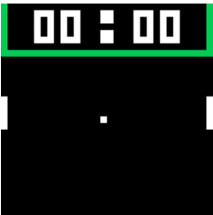
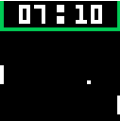
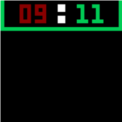

             _____
            |  _  |___  _ _   __
            |  ___|   \| ' \ /  \
            |  | |  |  | || | |  |
            |__|  \___/|_||_|\__/|
                                 |
                              \__/

## Pong
Pong was created in an effort to begin the learning journey of assembly 6502.
This was created after going through the easy6502 tutorial in which the creator walks you through the basic commands, shows you how they made a snake clone, and leaves you to tinker with the 6502 simulated environment they created.

I created pong entirely from scratch.

## How to Play
To play pong, load the code into one of easy6502's assemblers, hit assemble, and then run.

You control 2 paddles, the left side is controlled with W and S keys while the right side with P and L keys.
Once one player reaches the score of 11 they win.

